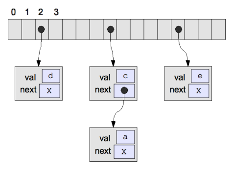

Hash Tables
======

- ```Hash Table```: Array of k buckets
- ```Hash Funciton```: Take a key value and calculate a valid bucket index
- ```Collisions```: Occur when different input elemetns map to the same bucket

### Closed Hsahing (Open Addressing)
```Linear Probing```: Keep adding one and trying again
- On lookup, looks where the hash function tells you to go, then starts probing until you find what youer' looking for, or find an empty slot (meaning it's not there)

###### Cost

- Typically allocate space for all entries at beginning
    - ```Disadvantage```: May be wasteful if table mostly empty much of the time
    - ```Advantage```: Don't need to allocate new Node with each insert
    - Accessing element's value doesn't require a pointer dereference (slightly faster)

###### Is closed hashing really constant time?

- If table almost full of active elements, insert approaches O(N)
- If table has only few empty slots, lookup approaches O(N)

### Open Hashing

#### Open Hashing with Chaining

Using a list of lists from a priority queue implementation, each bucket holds a ptr (to a list) rather than an element



###### Is open hashing really constant time?

- Best Case: No collisions, O(1) lookup
- Worst Case: All inputs map to the same bucket, O(N) lookup
- Perfect Hash Function: No collisions with N<=K
- Otherwise: If N>K, guaranteed to have collisions

### Characteristics of Hash Functions

1.  Consistent: Gets the same answer for the same input
- Uniformity: Good, even-ish spread of results over buckets
- Cheap to compute
- Supports variable range (Ex. Adapts when # of buckets change)

### Improving the Odds

1. Create a better hash function
2. Increase number of buckets
    - Ex. Amortized constant time to allow table to double in size every so often
